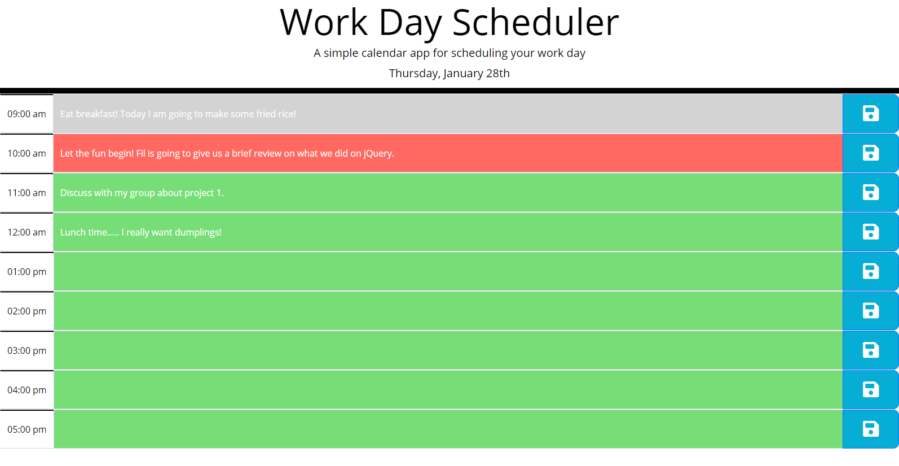

# 05 Third-Party APIs: Work Day Scheduler

## Deployed Link: 
https://dragontalker.github.io/BootCamp_Project5_WorkDayScheduler/

## Screenshots

This screen shot was taken at 10:07am on Thursday, Jan 28th.



## Overview

This project creates a simple calendar application that allows a user to save events for each hour of the day by modifying starter code. This app will run in the browser and feature dynamically updated HTML and CSS powered by jQuery, main features as follows:

1. The app highlights the current time block in red, past time block in grey, and future time block in green.
2. The app dynamically updates the color based on real time after each reload. 
3. The app allows user to save/update the even information input by click the save button, the data will not be lost after reload.

## User Story

```md
AS AN employee with a busy schedule
I WANT to add important events to a daily planner
SO THAT I can manage my time effectively
```

## Acceptance Criteria

```md
GIVEN I am using a daily planner to create a schedule
WHEN I open the planner
THEN the current day is displayed at the top of the calendar
WHEN I scroll down
THEN I am presented with timeblocks for standard business hours
WHEN I view the timeblocks for that day
THEN each timeblock is color coded to indicate whether it is in the past, present, or future
WHEN I click into a timeblock
THEN I can enter an event
WHEN I click the save button for that timeblock
THEN the text for that event is saved in local storage
WHEN I refresh the page
THEN the saved events persist
```